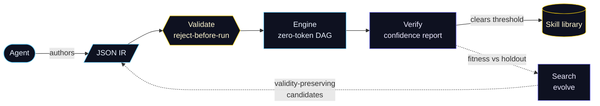
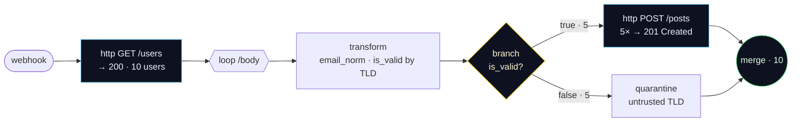

<div align="center">


<h1>A2W</h1>

<p><strong>An agent-native workflow engine that proves its own work.</strong></p>

<p>
AI agents author, validate, run, <strong>verify</strong>, and evolve workflows over a narrow,
deterministic JSON IR. Everyday runs are reproducible byte-for-byte and never touch an LLM —
and the system emits <em>calibrated evidence</em> that the outcome is correct, not just that it ran.
</p>

<p>


</p>

<p>
<a href="https://gowdaharshith1998-lang.github.io/A2W/"><strong>↗ Open the interactive, animated experience</strong></a>
&nbsp;·&nbsp;
<a href="#the-loop">The loop</a>
&nbsp;·&nbsp;
<a href="#proven--workflows-we-ran-and-verified">Proven</a>
&nbsp;·&nbsp;
<a href="#what-verification-means-here">Verification</a>
&nbsp;·&nbsp;
<a href="#crates">Crates</a>
&nbsp;·&nbsp;
<a href="./docs/PRODUCTION.md">Production guide</a>
</p>

</div>

---

## Why A2W

Most "agent builds a workflow" systems can tell you a run *finished*. A2W is built to tell you the
run is **right** — and to make that nearly free by keeping execution **deterministic and
zero-token**, so correctness can be checked exhaustively without spending a single token.

- **Deterministic & zero-token execution.** A run is reproducible byte-for-byte given the same IR +
  inputs, and never calls an LLM, the network (except through declared, guarded node I/O), the wall
  clock, or unseeded RNG. *Authoring* may use an LLM; *execution* may not.
- **Reject-before-execute.** Invalid IR fails at `validate()` — typed ports, acyclicity, required
  fields/roles — so the executor may assume validity as a precondition.
- **Outcome verification, calibrated.** The confidence report separates **engine-invariants** (which
  hold for *any* valid workflow) from **outcome evidence** (spec assertions, golden fixtures,
  cross-checks, spec-derived semantic relations). It never reports a bare "verified".
- **Self-improvement without Goodhart.** Search optimizes a *fitness* plan and certifies the winner
  on a **disjoint holdout**; the holdout score is what's reported and what gates promotion.

## The loop



> The pipeline **is** the product: a deterministic engine makes correctness testing nearly free, so
> every run can be verified and the good ones compound into a reusable, searchable skill library.
> The fully-animated, clickable version of this diagram lives in the
> [**interactive site**](https://gowdaharshith1998-lang.github.io/A2W/).

## Proven — workflows we ran and verified

Every workflow below is a **real IR document in [`examples/`](./examples)** that the test suite
loads, statically validates, runs **deterministically and zero-token**, and checks with a
calibrated confidence report. The flagship two were driven **live** — over real HTTP, against a
running `a2w-server` — and independently audited. Nothing here is decorative;
[`crates/a2w-acceptance`](./crates/a2w-acceptance/tests) is the proof.

### Live production ETL — real network, real writes, zero LLM tokens

[`examples/complex_etl_live.json`](./examples/complex_etl_live.json), driven live against a public
API and run twice with byte-identical results:



| Node | Behavior (real, observed) |
|---|---|
| `fetch` | `GET /users` → **HTTP 200**, body = **10 real users** (282 / 491 ms — a genuine outbound call) |
| `load` | **5 POSTs to `/posts` → every one HTTP 201 Created**, with an echoed `body.id` |
| `quarantine` | 5 records, `reason: untrusted_email_tld` |
| run total | **6 external calls · 0 LLM tokens** across all 16 step events |

A **second, independent agent** fetched the same source directly and applied the TLD policy by
hand — ground truth was **5 load / 5 quarantine, exactly what the workflow produced**. Full record:
[`docs/LIVE_PRODUCTION_ETL.md`](./docs/LIVE_PRODUCTION_ETL.md).

### Five Claude agents drive the full loop, live over HTTP

Five independent agents each authored a workflow and drove the entire loop — **author → run →
verify → promote → retrieve → evolve** — against a running server (API-key auth, AES-256-GCM vault,
SQLite persistence). Production execution was **zero-token**; promotion was gated on a
**disjoint holdout**:

| Workflow | run (prod) | verify | promote | find | evolve (certified) |
|---|---|---|---|---|---|
| `area` · `discount` · `distance` · `invoice` · `payroll` | ✅ zero-token | ✅ `1.00` | ✅ holdout `1.0` | ✅ top match | ✅ `0.0 → 1.0`, gap `0.0` |

**5 / 5 agents passed all 6 steps.** Skills, runs, and step records were then confirmed by reading
the SQLite file directly, independent of the HTTP API. Full record:
[`docs/LIVE_MULTIAGENT_DEMO.md`](./docs/LIVE_MULTIAGENT_DEMO.md).

### n8n-style automations — built, run, and asserted

Production-shaped flows that combine many node kinds, verified by
[`complex_n8n.rs`](./crates/a2w-acceptance/tests/complex_n8n.rs):

| Workflow | Shape |
|---|---|
| **Lead routing** | `webhook → score → classify → switch → {AE + CRM, nurture, newsletter, review} → merge` |
| **Order fulfillment** | `webhook ⇉ {loop → price, branch → branch → approval → ship} → merge` |
| **Ticket triage** | `webhook → switch → {page, escalate, LLM draft, autoclose} → merge` |
| **ETL sync** | `schedule → normalize → branch → {load, quarantine} → merge` |

…on top of a seven-workflow [gallery](./examples) exercising every routing primitive (branch,
switch, loop, merge, deep chains, HTTP shaping) — each one validated, run zero-token, and verified
by [`workflow_gallery.rs`](./crates/a2w-acceptance/tests/workflow_gallery.rs).

## What "verification" means here

Read this before trusting a score. A2W's engine is deterministic and per-item-independent *by
construction*, so a class of checks — **re-run identity, permutation invariance, duplication
scaling, additivity** — holds for **any** valid workflow. Those are **engine-invariants**: they
verify the *engine*, not the *outcome*, are reported separately, and are **never** counted toward an
outcome-correctness claim.

**Outcome verification** rests on spec assertions, golden fixtures, differential cross-checks, and
**spec-derived semantic relations** (which encode the workflow's *intent* and catch logic faults
engine-invariants structurally cannot — e.g. a workflow that computes `total` from the wrong field
passes every engine-invariant but fails a scaling relation). A report holding only engine-invariants
is labeled *"engine-verified; outcome UNVERIFIED."*

The **search** optimizes a fitness plan, so that score is not independent evidence about the winner.
The winner is re-scored on a **disjoint holdout** (a checked-disjoint contract); the holdout score is
reported and gates promotion, and any `overfit_gap` is surfaced, not hidden.

## Crates

A narrow IR at the core; everything else is a thin, testable layer around it.

| Crate | Layer | Purpose |
|---|---|---|
| `a2w-ir` | IR | The workflow IR — single source of truth |
| `a2w-validator` | IR | Static validity: cycles, ports, trigger uniqueness, per-kind required-field/role checks |
| `a2w-expr` | IR | Sandboxed, deterministic expression DSL (no I/O) |
| `a2w-engine` | Engine | Concurrent async DAG: bounded fan-out, retry, port-indexed routing, lineage |
| `a2w-nodes` | Engine | 14 tested node executors (triggers, http, transform, branch/switch/loop, sub-workflow, …) |
| `a2w-verify` | Verify | Calibrated report separating **engine-invariants** from **outcome evidence** |
| `a2w-skills` | Memory | Promote (gated on outcome evidence), index by task signature, retrieve & compose; in-memory or persisted |
| `a2w-search` | Memory | RNG-free beam search; selects by fitness, certifies on a **disjoint holdout**, reports `overfit_gap` |
| `a2w-store` | Serving | sqlite persistence (workflows, runs, skills) + AES-256-GCM vault |
| `a2w-server` | Serving | REST API + dashboard (axum), API-key auth, `/metrics`, `/ready` |
| `a2w-mcp` | Serving | MCP stdio server exposing `wf_*` tools |
| `a2w-author` · `a2w-llm` | Authoring | Generate→Validate→Repair loop + LLM client abstraction |
| `a2w-optimizer` · `a2w-templates` · `a2w-import` · `a2w-openapi` | Tooling | Profiling/optimization, golden templates, n8n & OpenAPI import |
| `a2w-testkit` · `a2w-bench` · `a2w-acceptance` | Quality | Declarative tests, Criterion benches, end-to-end acceptance |

## Quickstart

```bash
# Build + test the workspace (deterministic, network-free).
cargo test --workspace

# Serve the REST API + dashboard with the credential vault enabled.
A2W_MASTER_KEY="$(head -c 32 /dev/urandom | base64)" \
A2W_API_KEY="dev-key" \
cargo run -p a2w-server
# → http://127.0.0.1:8080   (dashboard at /, plus POST /verify · POST /skills · GET /skills)

# Run the MCP stdio server (fail-closed by default; opt in per surface).
A2W_MASTER_KEY=... A2W_MCP_ALLOW_RUN=true A2W_MCP_ALLOWED_COMMANDS=a2w-mcp \
cargo run -p a2w-mcp
```

## MCP tools

| Tool | Purpose |
|---|---|
| `wf_get_schema` · `wf_describe_nodes` | Learn the IR schema + node taxonomy |
| `wf_validate` | Static validation report |
| `wf_dry_run` · `wf_run` | Run mocked (always allowed) / for real (gated by `A2W_MCP_ALLOW_RUN`) |
| `wf_verify` | Run a verification plan → calibrated confidence report |
| `wf_promote_skill` | Verify on a holdout plan, then persist as a skill iff it clears the threshold |
| `wf_find_skill` | Retrieve persisted skills by query signature |
| `wf_run_tests` · `wf_profile` · `wf_optimize` · `wf_apply_ops` | Test, profile, suggest & apply IR diffs |
| `wf_search_templates` · `wf_get_template` | Browse the golden template corpus |
| `wf_*_credential` · `generate_workflow_from_prompt` | Vault writes / LLM authoring (policy-gated) |

## Status

20 crates · 391 tests (0 failing) · clippy-clean · cargo-deny-clean · schema v7 · multi-stage Docker
image. CI runs **fmt + clippy (`-D warnings`) + test (`--workspace --locked`) + cargo-audit +
cargo-deny + docker build & smoke** — all six jobs are required (cargo-deny included). All 14 node
kinds have tested executors. The local gate and the `--workspace --locked` CI gate run the same suite.

**Known limitations** (calibrated): engine-invariant relations assert engine guarantees only —
outcome correctness depends on the quality of the spec/golden/semantic evidence an author supplies;
skill retrieval ranks by loading all rows in memory (fine at current scale); query-adaptive sampling
is gated behind the multi-tenant auth wall; Postgres needs SQL-portability work.

## Documentation

- **[Interactive site](https://gowdaharshith1998-lang.github.io/A2W/)** — animated, clickable tour of the loop.
- **[Production guide](./docs/PRODUCTION.md)** — env-var contract, endpoints, Docker, threat model.
- **[Engineering log](./docs/CONTINUATION.md)** — the build/audit history and current state.

<div align="center">
<sub><strong>Proprietary — © 2026 Harshith Gowda. All rights reserved.</strong> Not open source; see <a href="./LICENSE">LICENSE</a>. Viewing this repository grants no license to use, copy, modify, or distribute the software.</sub>
</div>
